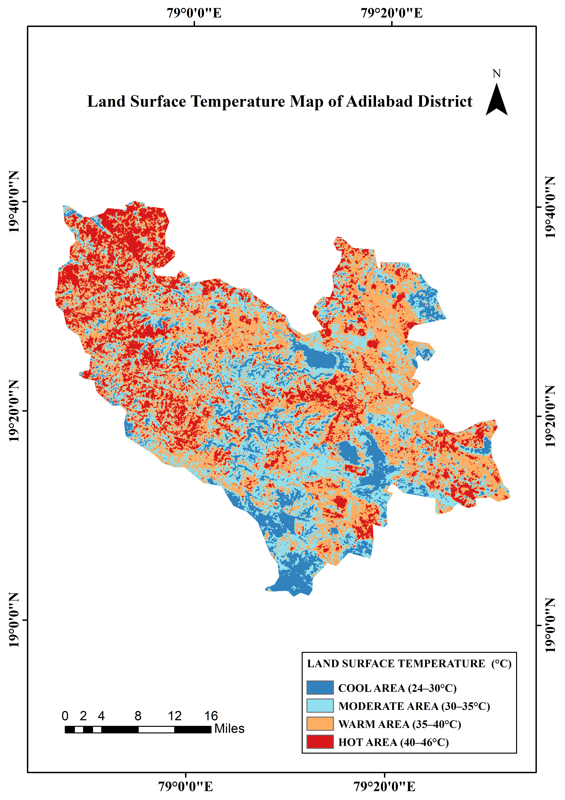
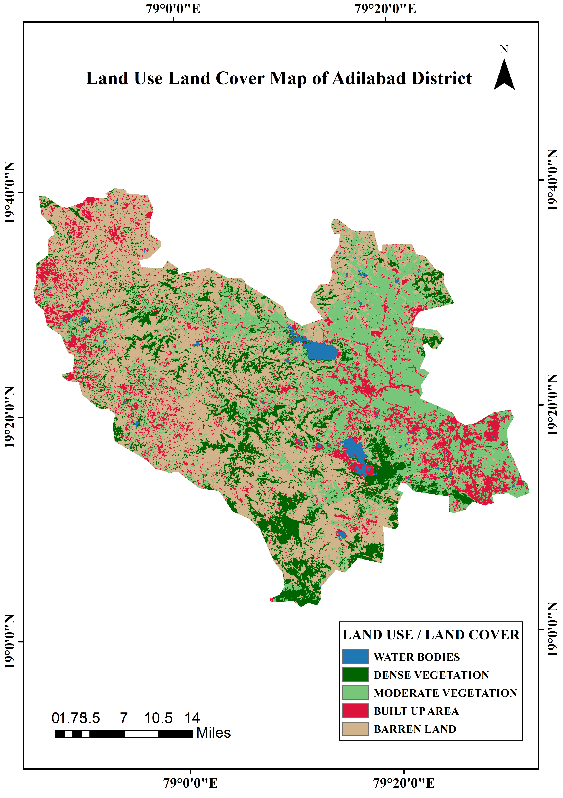
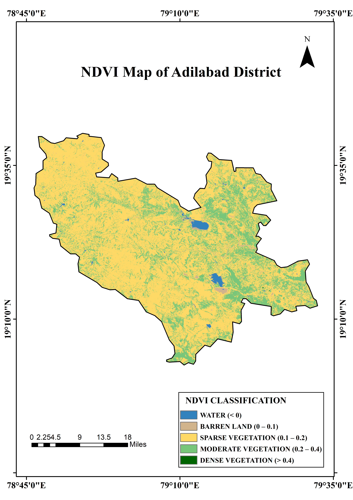

# GIS Analysis of Adilabad District

## 📌 Overview
This project includes spatial analysis of Adilabad District using GIS techniques.

## 📷 Maps

### 🌡️ Land Surface Temperature

### 🌍 Land Use Land Cover

### 🌱 NDVI Analysis

## 📊 Analysis
- Built-up areas show higher temperatures
- Vegetation areas have lower temperature
- NDVI confirms vegetation density

## 🛠️ Tools Used
- ArcGIS
- Remote Sensing
- Landsat Data

## 👤 Author
AADIL MUBARAK P N
